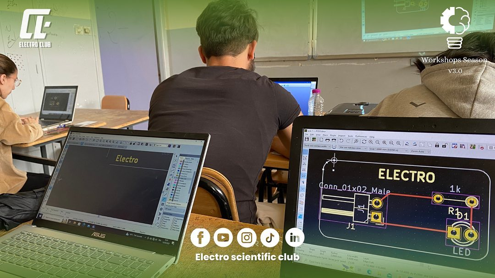

# Workshops Season 2023 (Ed 3.0)
[](https://techforpalestine.org/learn-more)

[](LICENSE)


Welcome to the repository of our Electro's Workshops Season 2023! Here, you'll find a wealth of knowledge and resources from our workshops, covering a diverse range of topics in the fields of Hardware Engineering, 3D Printing and Design, Embedded Systems, and PCB Design.

## About
This repository contains the workshop materials and slides from our exciting workshops conducted during the 2023 edition. Whether you're a club member, a curious learner, or someone interested in these fields, you'll find valuable resources here.


## Workshop Topics:

### 1) [Hardware Engineering](Slides/electro_sc_hardware_engineering_workshop.pdf)
   - **Overview**: Introduction to Hardware Engineering with a focus on Embedded Systems, Industrial Automation, Electronics, FpGAs, ASIC, etc.
   - **Comparison**: Highlighting the distinctions between hardware and software engineering.
   - **Software Engineering**: Touching upon Data Science, Web Development, App Development, DevOps, AI, and more.

### 2) [3D Printers and 3D Design using SolidWorks](Slides/electro_sc_3d_printers_tech_workshop.pdf)
   - **3D Printing**: Types of 3D printers, effective usage, slicing with Ultimaker Cura, and building a 3D printer from scratch.
   - **SolidWorks**: An overview of 3D design, including sketching, part creation, assembly, and more.

### 3) [Embedded Systems and STM32](Slides/electro_sc_embedded_stm32_workshop.pdf)
   - **Embedded Systems Overview**: Understanding microcontrollers vs. microprocessors, MCU internals, and programming basics.
   - **Practical Session**: Configuring STM32 pins, programming with STM32CubeIDE, and hands-on experience with GPIOs, ADCs, DMA, Timers, SPI, I2C, etc.

### 4) [PCB Design using KiCad](Slides/electro_sc_pcb_design_kicad_workshop.pdf)
   - **PCB Basics**: Insight into PCB manufacturing, essential materials, design principles, and common mistakes.
   - **KiCad Workshop**: Designing a simple PCB using KiCad 6 software and learning how to order it online.

<!--
## External Resources:

To enhance your learning experience, make sure to explore the external resources linked below:

1. **Hardware Engineering and Software Development**: [link](link)
2. **3D Printing and Design**: [link](link)
3. **Embedded Systems and STM32 Programming**: [link](link)
4. **PCB Design Principles and KiCad Tutorials**: [link](link)

Feel free to dive into these external resources to deepen your understanding and further develop your skills in the respective workshop topics.
-->

## How to Access Workshop Slides:

Each workshop's slides are available in the corresponding folder within this repository. Click on the [slides](Slides) folder above to access the presentation materials.

We hope you find these workshops insightful and educational. Happy learning! 🚀


## Thank _You_!
Please :star: this repo to help us improve the quality.
<br><br>


## Media
Here are some pictures taken during our Arduino Bootcamp!

## Pictures Captured During The Bootcamp
3D Design Workshop, Picture 1           | 3D Design Workshop, Picture 2
:---------------------:|:------------------:
 | 
Embedded Workshop, Picture 3         |  Embedded, Workshop Picture 4
 | 
PCB Design Workshop, Picture 5         |  PCB Design Workshop, Picture 6
 | 


## Get Started

1. Install this repository, click <a href="https://github.com/electro-sc/Workshops-Season-2023/archive/master.zip"> here </a> to install it. Or use git command:
```bach
git clone https://github.com/electro-sc/Workshops-Season-2023.git
```
2. Extract the folder and open it.
3. Navigate for the [Slides](Slides) folder in order to see our presentations.
<!-- 4. Navigate for the [external_resources](external_resources) folder in order to dive into more deep knowlege.-->


## License
The content of this project is licenced under the [MIT License](LICENSE).

## Contributing 💡
If you want to contribute to this project and make it better with new ideas, your pull request is very welcomed.<br>
If you find any issue just put it in the repository issue section, thanks!<br><br>
.سبحَانَكَ اللَّهُمَّ وَبِحَمْدِكَ، أَشْهَدُ أَنْ لا إِلهَ إِلأَ انْتَ أَسْتَغْفِرُكَ وَأَتْوبُ إِلَيْكَ
